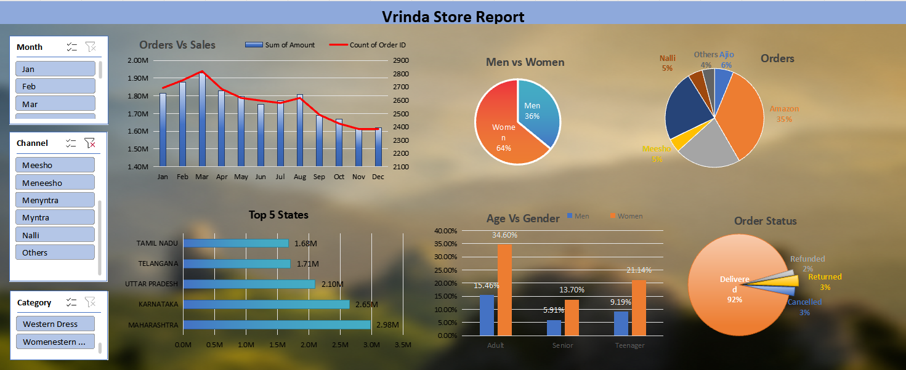

# Vrinda Store Sales Analysis | Excel Dashboard

An Excel-based sales analysis and interactive dashboard for Vrinda Store. The dashboard provides an overview of sales performance across different months, customer demographics, states, sales channels, and order statuses.

> **Project Note:** This project was created as an early Excel learning project by following an online tutorial using the Vrinda Store dataset. It is included in this repository as part of my hands-on practice with Excel dashboards, Pivot Tables, Pivot Charts, and Slicers.

---

## Dashboard Preview

---

## Project Overview

The dashboard provides a visual analysis of Vrinda Store's sales data and helps identify patterns across:

- Monthly sales and order trends
- Customer gender
- Customer age groups
- Top-performing states
- Sales channels
- Order status

Interactive slicers are available for filtering the dashboard by:

- Month
- Channel
- Category

---

## Key Metrics

| Metric | Value |
|---|---:|
| Total Sales | ₹21.18M |
| Total Orders | 31,047 |
| Average Order Value | ₹682.07 |
| Delivered Orders | 28,641 |
| Delivery Rate | ~92% |

---

## Key Insights

- Women accounted for approximately **64% of total sales**, compared with 36% for men.
- **Maharashtra, Karnataka, and Uttar Pradesh** were the top three states by sales.
- The **Adult age group (30–49 years)** contributed the highest share of sales.
- **Amazon, Flipkart, and Myntra** were the leading sales channels.
- Approximately **92% of orders were delivered**, while the remaining orders were returned, cancelled, or refunded.

---

## Business Recommendation

Based on the dashboard analysis, a potential strategy would be to focus marketing efforts on:

- Women customers
- Customers in the Adult age group (30–49 years)
- High-performing states such as Maharashtra, Karnataka, and Uttar Pradesh
- Major sales channels such as Amazon, Flipkart, and Myntra

Targeted offers, discounts, and promotional campaigns through these channels could help improve customer engagement and sales.

---

## Tools & Techniques

- Microsoft Excel
- Pivot Tables
- Pivot Charts
- Slicers
- Data Cleaning
- Data Aggregation
- Data Visualization
- Sales Analysis

---

## Dashboard Components

### 1. Orders vs Sales
Monthly comparison of total sales amount and number of orders.

### 2. Men vs Women
Comparison of sales contribution by gender.

### 3. Orders by Channel
Distribution of orders across different sales channels.

### 4. Top 5 States
Identification of the top-performing states based on sales.

### 5. Age vs Gender
Comparison of sales contribution across different age groups and genders.

### 6. Order Status
Overview of delivered, returned, cancelled, and refunded orders.

---

## Files

| Folder | Description |
|---|---|
| `Dashboard/` | Excel dashboard workbook |
| `Dataset/` | Original dataset used for the analysis |
| `Screenshots/` | Dashboard preview image |
| `Documentation/` | Additional project documentation |

---

## Learning Outcome

This project provided hands-on practice with:

- Building interactive Excel dashboards
- Working with Pivot Tables and Pivot Charts
- Using Slicers for interactive filtering
- Summarizing sales data
- Identifying customer and sales patterns
- Presenting business insights visually

---

## Disclaimer

This repository represents an early learning project created using an online tutorial and the publicly available Vrinda Store dataset. The dashboard is preserved as a record of Excel dashboard practice and learning.
